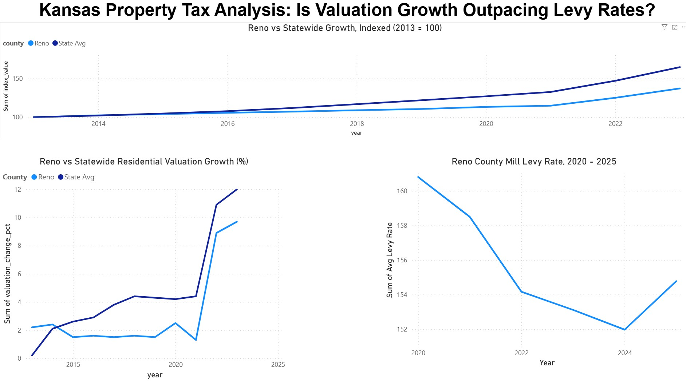
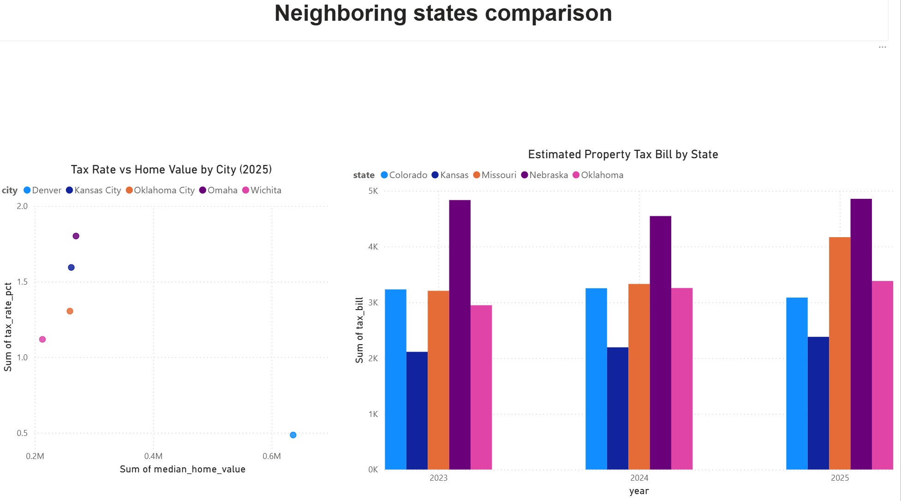

# Kansas Property Tax Analysis

**Is Kansas property tax growth driven more by rising valuations or rising mill levy rates — and would moving to a neighboring state actually help?**

A data pipeline (Python → SQL → Power BI) built to answer a real question about my own property tax bill in Reno County, Kansas, and to see whether that experience reflects a Kansas-wide pattern or an outlier.

---

## Dashboard

**Page 1 — Reno County Deep Dive**



Three charts: Reno vs. statewide valuation growth (indexed to 2013 = 100), the same comparison as year-over-year % change, and Reno County's mill levy rate 2020–2025. Together they show the core finding — Reno's tax bill is climbing because of rising valuations, not rising rates, even though Reno's own valuation growth trails the state average.

**Page 2 — Neighbor State Comparison**



A bar chart comparing estimated property tax bills across Kansas (Wichita), Missouri (Kansas City), Nebraska (Omaha), Oklahoma (Oklahoma City), and Colorado (Denver), 2023–2025, alongside a scatter plot of tax rate vs. median home value for 2025 — showing that Wichita's low tax bill comes from a genuinely low home value paired with a moderate rate, while Colorado's low rate is offset by a much higher home value.

*(Replace the two image links above with your actual screenshot files — export each Power BI page as an image and save them to a `screenshots/` folder in the repo.)*

---

## Key findings

1. **Valuation, not rate, is driving the increase.** Reno County's average mill levy actually *fell* from 160.8 (2020) to 152.0 (2024) before ticking back up slightly to 154.8 in 2025. Over the same window, statewide assessed valuation grew from $39.3B to $53.6B — a 36% increase. The tax bill is climbing because homes are worth more on paper, not because local governments raised rates.

2. **Reno's valuation growth has run below the statewide pace for a decade.** Indexed to 100 in 2013, Reno County's residential valuation reached 137.1 by 2023, while the Kansas state average reached 164.6 over the same period. Kansas as a whole is heating up faster than Reno specifically.

3. **Residential property is shouldering a growing share of the total tax burden.** Statewide, residential property's share of total property tax collected rose from 41% (1998) to 58% (2025) — a structural shift independent of overall growth. This isn't a change in assessment policy (the residential assessment ratio has held at 11.5% throughout); it reflects residential property becoming a larger share of the state's total value, with homeowners absorbing a proportionally bigger piece of the tax base.

4. **Wichita — Kansas's benchmark city in this comparison — has the lowest median tax bill of five comparable regional cities in every year 2023–2025.** Against Denver (CO), Oklahoma City (OK), Kansas City (MO), and Omaha (NE), Wichita's estimated tax bill on a median-valued home was the lowest each year ($2,381 in 2025 vs. $3,085–$4,857 for the others). Moving to a neighboring state's largest city would not, on this measure, reduce the tax bill. Colorado's notably low tax *rate* is offset by a median home value roughly 3x Wichita's, so its actual dollar bill lands in the middle of the pack, not the bottom.

---

## Data sources

| Source | Coverage | Used for |
|---|---|---|
| Kansas Dept. of Revenue (KDOR), Property Valuation Division — Mill Levy tables | 105 counties, 2020–2025 | County-level mill levy rates |
| KDOR — Historical Statewide Data (Appraised, Assessed, Tax) | Statewide, 1998–2025 | Statewide valuation and tax trend |
| Kansas Open Gov / Kansas Policy Institute — "Assessed Valuation Change on Existing Residential Property," originally sourced from KDOR open records requests | County-level, 2013–2023 | Reno County vs. statewide valuation growth |
| Lincoln Institute of Land Policy & Minnesota Center for Fiscal Excellence — *50-State Property Tax Comparison Study* | 5 states' largest cities, 2023–2025 | Kansas vs. Missouri, Nebraska, Oklahoma, Colorado comparison |

## Methodology

- PDF extraction with `pdfplumber` (Poppler's `pdftotext` was unavailable on the development machine, so all parsing uses pure-Python PDF text extraction)
- Content-based table location for multi-page/multi-reference PDFs — rather than assuming a fixed page number, the pipeline searches document text for the actual table header and verifies it with a nearby structural marker (e.g. `"Tax Rate (%)"`) before extracting, since table titles often appear multiple times in narrative text before the real table
- Regex-based row parsing, validated row-by-row against source PDF values at each step
- All tables loaded into a single SQLite database (`kansas_tax.db`) as the source of truth, with CSV snapshots kept alongside for portability
- SQL views built on top of the base tables (indexed valuation series, county levy change, latest snapshot) so downstream tools query clean, pre-joined data
- Dashboard built in Power BI, loading from the processed CSVs

## Repo structure

```
kansas_tax_analysis/
├── data/
│   ├── raw/
│   │   ├── kdor/                       KDOR mill levy + historic statewide PDFs, and
│   │   │                                Kansas Open Gov valuation-change CSV
│   │   └── lincoln_institute/          50-State Property Tax Comparison PDFs
│   └── processed/
│       ├── kansas_tax.db               SQLite database (source of truth)
│       └── *.csv                       CSV snapshots of each table/view
├── notebooks/
│   ├── 01_extract_clean.ipynb          Mill levies, statewide valuation, Reno-vs-state valuation
│   ├── 02_pvd_historic_tax.ipynb       Statewide historic tax + appraised value
│   ├── 03_lincoln_extract.ipynb        Neighbor-state comparison
│   └── 04_sql_views.ipynb              SQL views for Power BI
├── pbix/
│   └── kansas_tax_analysis_visuals.pbix
└── screenshots/                        Dashboard page exports (for this README)
```

## How to reproduce

1. Clone the repo and install dependencies (`uv sync`, or `pip install -r requirements.txt` if using pip)
2. Run the notebooks in order: `01_extract_clean.ipynb` → `02_pvd_historic_tax.ipynb` → `03_lincoln_extract.ipynb` → `04_sql_views.ipynb`. Each notebook parses its source PDFs/CSVs, validates the result against the original source, and loads the output into `data/processed/kansas_tax.db` plus a CSV snapshot.
3. Open `pbix/kansas_tax_analysis_visuals.pbix` in Power BI Desktop and refresh the data sources if needed (File → Options → Data source settings), or point the queries at your own local `data/processed/` path if it differs from the original.

## Limitations

- **Geographic scope mismatch in places.** Kansas's historic appraised/assessed/tax series are statewide, not Reno-specific; the Reno-vs-state valuation comparison fills part of this gap but only covers 2013–2023 and only residential property on existing homes.
- **The neighbor-state comparison uses each state's largest city, not a statewide average** (per Lincoln Institute's standard methodology) — Wichita, Kansas City, Omaha, Oklahoma City, and Denver. This is a reasonable, commonly-used proxy but is not a full statewide comparison.
- **Tax bill differences reflect home value differences as much as rate differences.** Wichita's lower tax bill is partly a function of Wichita's lower median home value ($212,900 vs. up to $636,400 in Denver), not solely a lower effective burden.

## Tech stack

Python (pandas, pdfplumber, sqlite3) · SQL · Power BI

---

*Built as a portfolio project demonstrating an end-to-end data pipeline: unstructured PDF sources → validated, structured SQL data → interactive BI dashboard, applied to a real personal and civic question.*